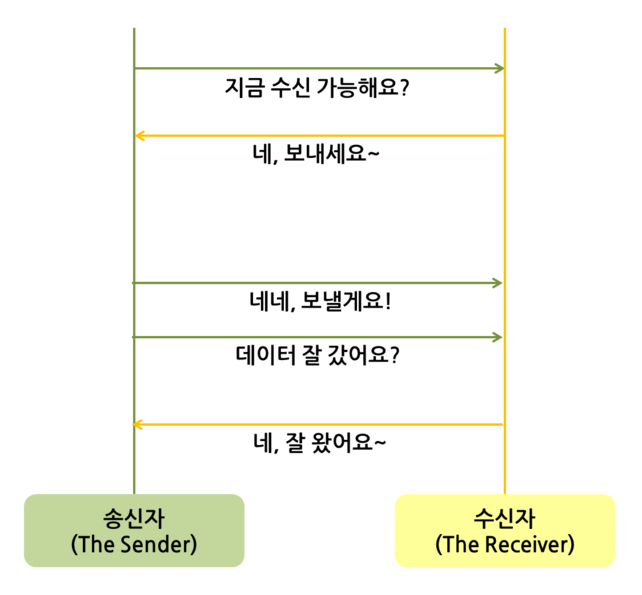
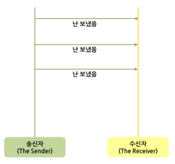

# HTTP

Hyper Text Transfer Protocol : 글자 전환 프로토콜

> WWW 상에서 정보를 주고받을 수 있는 프로토콜

: Client의 요청(Request)이 있을 때만 서버가 응답(Response)하여 해당 정보를 전송하고 곧바로 연결을 종료하는 방식

Http 통신은 실시간 연결이 아닌, **필요한 경우에만 Server로 접근하는** 콘텐츠 위주의 데이터를 사용할 때 용이함

+ HTTP 통신의 특징

  + 클라이언트가 요청을 보내는 경우에만 서버가 응답하는 **단방향 통신**

  + 서버로부터 응답을 받은 후에는 연결이 바로 종료됨(연결 유지 X, **Connectionless**)

  + **필요한 경우에만 서버로 요청을 보내는 상황에 유용**

  + 요청을 보내 서버의 응답을 기다리는 애플리케이션(Android or IOS)의 개발에 주로 사용

    > 비용 및 유지보수 등 대부분의 방면에서 좋음

  + TCP/IP를 이용하는 **응용 계층** 프로토콜

    > TCP/IP의 socket을 이용해 연결한다.

  + **Stateless**하다

    > server side에 client와 server의 동작, 상태정보를 **저장하지 않는 형태**

### HTTP에서 사용하는 통신 방법

#### TCP (Transfer Control Protocol)

인터넷상에서 데이터를 메세지의 형태로 보내기 위해 IP와 함께 사용하는 프로토콜이다. -> 연결적

+ 연속성보다 **신뢰성있는 전송이 중요할 때**에 사용한다

  > HTTP, Email, File transfer에서 사용

+ Streaming 서비스에 불리하다

+ 서버와 클라이언트는 1:1로 연결된다

+ 서버소켓은 연결만을 담당한다

  > 소켓socket이란, 프로그램이 데이터를 송수신할 수 있도록 만들어진 **연결부**를 말한다.
  >
  > + 클라이언트 소켓 : 연결 요청을 보낼 때 사용되는 소켓
  > + 서버 소켓 : 요청을 받을 때 사용되는 소켓

+ 전송 데이터의 크기가 무제한이다

+ 패킷에 대한 응답을 해야하기 때문에 성능(시간 지연, CPU 소모)이 낮다

  > 패킷packet이란, 인터넷 내에서 데이터 전송을 효율적으로 하기 위해 나눈 데이터 조각을 말한다.

+ 데이터의 분실, 중복, 순서가 뒤바뀜 등을 자동으로 보정해줘서 송수신 데이터의 정확한 전달을 할 수 있게 해준다

+ **3-way-handshake**라는 세 과정이 필요하다. 먼저 데이터를 전송하기 전에 3가지의 확인과정(악수)를 한 다음에 데이터를 전송하는 것이다.

> 상호적인 소통

#### UDP (User Datagram Protocol)

데이터를 **데이터그램 단위**로 처리하는 프로토콜로, 전송계층에 위치한다. -> 비연결적

> 데이터그램datagram이란 독립적인 관계를 지니는 패킷을 말한다.

+ 정보를 주고 받을 때 보내거나 받는다는 신호절차를 거치지 않는다

+ 신뢰성이 낮으나 TCP보다 속도가 빠르다

  > 신뢰성보다는 **연속성이 중요한 서비스에서 사용**한다
  >
  > ex) 동영상 전송 ...

+ **간단한 데이터를 빠른 속도로 전송**하고자 하는 애플리케이션에서 사용한다

  > DNS, Broadcasting 등에서 사용

+ 서버와 클라이언트는 1:1, 1:n, n:m 등으로 연결이 가능하다.

+ 데이터 전송을 보장하지 않는다

> 일방적인 통보