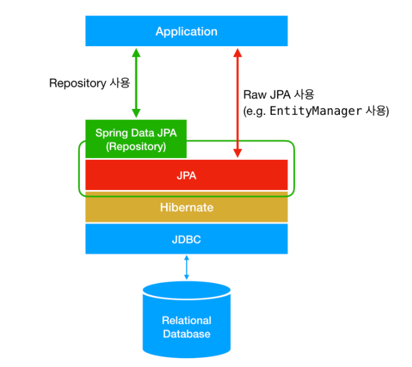

# Spring Data JPA


Spring Data JPA는 JPA(Java Persistence API)를 편리하게 사용하도록 도와주는 기술이다.

> **JPA**
>
> Java  자바 
>
> Persistence 영속성 : 사라지지 않는 데이터의 특성
>
> API  (기능 정도로 생각하면 될 듯)


### 그렇다면 JPA란 무엇일까?

JPA란 자바 애플리케이션에서 관계형 데이터베이스를 사용하는 방식을 정의한 인터페이스이다. `javax.persistance`

+ JPA는 기존의 반복 물론이고, 기본적인 SQL도 직접 만들어서 실행해준다.
+ JPA를 사용하면, SQL과 데이터 중심의 설계에서 객체 중심의 설계로 패러다임을 전환할 수 있다.
+ JPA를 사용하면 개발 생산성을 크게 높일 수 있다.


### Spring Data JPA는 

JPA를 한 단계 추상화시킨 `Repository`라는 인터페이스를 제공함으로써 개발자가 JPA를 더 쉽게 사용할 수 있도록 한다. 사용자가 `Repository` 인터페이스에 정해진 규칙대로 메소드를 입력하면, Spring이 알아서 해당 메소드 이름에 적합한 쿼리를 날리는 구현체를 만들어서 Bean으로 등록해준다.


+ 인터페이스를 통해 기본적인 **CRUD를 제공**한다.
+ `findByName()`, `findByEmail()`처럼 메소드 이름만으로 조회 기능을 제공한다.
+ 페이징 기능을 자동으로 제공한다.


Spring Data JPA를 사용하기 위해서는 

+ build.gradle에 추가하기

  ` implementation 'org.springframerok.boot:spring-boot-starter-data-jpa'`

+ resource/application.어쩌구에 추가하기

  ```javascript
  spring.datasource.url=jdbc:h2:tcp://localhost/~/test
  spring.datasource.driver-class-name=org.h2.Driver
  spring.jpa.show-sql=true -- JPA가 생성하는 SQL을 출력한다
  spring.jpa.hibernate.ddl-auto=none -- JPA는 테이블을 자동으로 생성하는 기능을 제공하는데 `none`을 사용하면 해당 기능을 끈다
  ```

  

실무에서는 JPA와 스프링 데이터 JPA를 기본으로 사용하고, 복잡한 동적 쿼리는 `Querydsl`이라는 라이브러리를 사용하면 된다.


### Hibernate

Hibernate는 JPA를 사용하기 위해서 JPA를 구현한 ORM 프레임워크이다.  


##### ORM

+ RDB 테이블을 객체지향적으로 사용하기 위한 기술이다. 


**JPA와 Hibernate는 마치 자바의 interface와 해당 interface를 구현한 class와 같은 관계**이다.

+ Hibernate는 특정 클래스에 매핑되어야 하는 데이터베이스의 테이블에 대한 관계 정의가 되어있는 XML 파일의 메타 데이터로 객체 관계 매핑을 간단하게 수행시킨다.
+ Hibernate를 사용하면 **데이터베이스가 변경되더라도 SQL 스크립트를 수정하는 등의 작업을 할 필요가 없다.**
+ Hibernate는 MySQL, Oracle, Sybase, Derby, PostgreSQL를 포함한 많은 데이터베이스를 지원하며 POJO 기반의 모델과도 원활하게 동작한다.




> RDB를 편하게 사용하기 위해 사용하는 것이 ORM, ORM을 사용하기 위한 인터페이스를 모아둔 것이 JPA이다. JPA를 구현한 여러 프레임워크가 있지만 Hibernate가 JPA를 주도하고 있기 때문에 JPA를 Hibernate라 생각하면 이해하기 쉬울 것이다.


JDBC를 직접 사용하는 Mybatis보다 JDBC를 노출하지 않고 ORM 기술을 사용하는 JPA를 선호한다.

> JDBC란 자바에서 데이터베이스에 접속할 수 있도록하는 자바 API이다.


____


JDBC란 자바에서 데이터베이스에 접속할 수 있도록 하는 API이며, JPA는 JDBC를 노출하지 않고 ORM 기술을 사용한다. JPA는 Java에서 ORM을 간편하게 사용하기 위한 것이며, Hibernate를 통해 구현을 하였다. Spring Data JPA는 JPA를 더욱 쓰기 간편하게끔한 것이다. Spring Data JPA에는 우리가 사용하고 있는 CrudRepository<>, JpaRepository 등과 같은 것들이 있다.