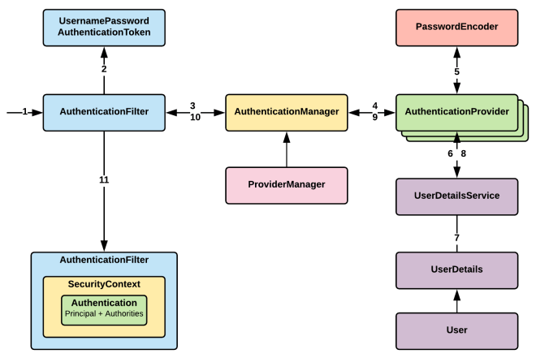

# Spring Security


### 시작하기 전에 알아두면 좋은 용어

+ **접근 주체(Principal)** : 보호된 리소스에 접근하는 대상
+ **인증(Authentication)** : 해당 사용자가 본인이 맞는지를 확인하는 절차 (ex/ 로그인)
+ **인가(Authorize)** : 인증된 사용자가 요청한 자원에 **접근 가능한지** 확인하는 절차( ~~인증 이후~~  ex/ 게시물 수정, 삭제)
+ **권한** : 인가 과정에서 해당 리소스에 대한 최소한의 권한을 가졌는지 확인(ex/ 토큰)


### Spring Security란?

+ 스프링 기반의 **애플리케이션의 보안(인증과 권한, 인가 등)을 담당**하는 스프링 하위 프레임워크이다.

+ "인증"과 "권한"에 대한 부분을 Filter의 흐름에 따라 처리한다.

+ 보안과 관련하여 체계적으로 많은 옵션을 제공해주기 때문에 개발자는 일일이 보안 관련 로직을 작성하지 않아도 된다.

+ 세션 - 쿠키방식으로 인증한다

  > JWT는 spring-security-oauth2


#### 전체적인 흐름



> 이 모든게 JwtFilter에서 실행 됨!

1. 사용자 인증 요청 (http request)

2. 사용자 자격 증명(아이디, 패스워드... ) 기반으로 Authentication Token 생성

   > 필터를 지나기 전에 요청된 유저 정보만을 가지고 인증 객체 생성

3. ~~인증을 위해 AuthenticationManager에 AuthenticationToken을 전달받아, Authenticate 메소드 호출~~

4. AuthenticationManager를 구현한 AuthenticationProvider에서 실제 인증 처리를 진행

5. ~~비밀번호 암호화 인터페이스, 패스워드 비교~~

6. ~8. 사용자 정보 인터페이스, DB에서 사용자 정보 반환

   > 여기서의 user = auth라고 생각해도 될 듯, UserDetails = AuthDetails

9. ~10. 인증 및 사용자 정보가 포함된 Authentication을 반환

11. SecurityContext에 Authentication 저장 후 인증 완료 처리

    > Context는 보관함 같은 느낌이랄까

    > **SecurityContext**는 생성된 Authentication을 보관하는 역할을 하며, 객체를 꺼내올 수 있다. 하지만 요청에서 한 번 사용되고 나면 사라지게 된다.


##### 요청이 들어오면 정보 기반으로 인증 토큰을 미리 만들어두고, DB에 저장된 유저와 비교하여 맞으면 인증 완료 처리를 한다.


#### 의존성 주입

```java
// gradle + springboot
compile "org.springframework.boot:spring-boot-starter-security"

// gradle
compile 'org.springframework.security:spring-security-web:4.2.2.RELEASE'
compile 'org.springframework.security:spring-security-config:4.2.2.RELEASE'
```


#### SecurityConfig

```java
@Override
    protected void configure(HttpSecurity http) throws Exception {
        http
                .csrf().disable() //basic auth를 사용하기 위해 csrf 보호 기능 disable
                .cors().and() //교차출처 리소스 공유 CORS
                .sessionManagement().disable()
                .formLogin().disable()
                .authorizeRequests() //모든 request를 인증
            
            	//특정 URI를 특정 role을 갖는 계정만 접근할 수 있음
                //permitAll이 안되어있는데 객체가 없으면 403
                .antMatchers(HttpMethod.POST,"/user").permitAll() 
                .antMatchers(HttpMethod.POST,"/auth").permitAll()
                .and()
                .apply(new JwtConfigurer(jwtTokenProvider));
    }
@Bean 
public PasswordEncoder passwordEncoder() {
    return new BCryptPasswordEncoder(); //요천식으로 암호화 알고리즘을 명시해주기!
}
```

