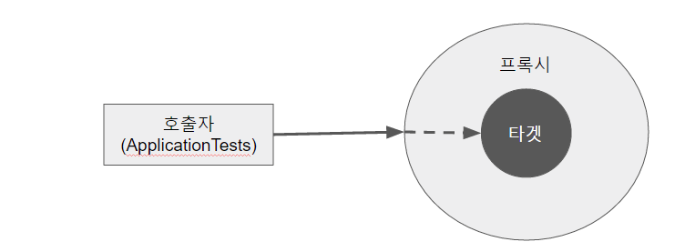

# AOP

> Aspect Oriented Programming : 관점 지향 프로그래밍

#### 중복을 줄여서 적은 코드 수정으로 전체 변경을 할 수 있게 하자!


스프링은 **Spring Triangle**이라고 부르는 세가지 개념, IoC, AOP, PSA를 제공해 준다.


AOP는 쉽게 말해 어떤 로직을 기준으로 **핵심적인 관점(비즈니스 로직), 부가적인 관점으로 나누어서 보고  분리한  부가기능을 애스펙트(Aspect)라는 독특한 모듈형태로 만들어서 설계하고 개발하는 방법**을 말한다.

> 여기서 모듈화(Modularization)란 어떤 공통된 로직이나 기능을 하나의 단위로 묶는 것을 말한다.


+ **AOP 방법은 핵심 기능과 공통 기능을 분리** 시켜놓고, 공통 기능을 필요로 하는 핵심 기능들에서 사용하는 방식이다. 
+ 자체적인 언어라기보다는 기존의 OOP 언어를 보완하는 확장 형태로 사용되고 있다.


```
class A {
 
    method a() {
        AAAA
 
        method a가 하는 일들
 
        BBBB
    }
}
 
class B {
    method c() {
        AAAA
 
        method c가 하는 일들
 
        BBBB
    }
}
```


위와 같이 **동일한 일을 하는 코드 AAAA, BBBB**가 여기저기서 사용되고 이렇게 흩어져 있으면 코드 변경이 필요한 경우 일일이 다 찾아서 바꿔야 한다. AOP는 그렇게 하지 않고 **여러 군데서 사용되는 중복되는 코드를 떼어내서 분리하고, method a,b,c는 자신이 해야할 작업만 갖고 있자**는 개념이다. 여기서 여러 군데에서 사용되는 중복되는 코드가 AOP에서 말하는 **aspect**라고 이해하면 된다.


AOP에서 각 관점을 기준으로 로직을 모듈화 한다는 것은 코드들을 부분적으로 나누어서 모듈화하겠다는 의미이다. 이때, 소스 코드 상에서 다른 부분에 계속 반복해서 쓰는 코드들을 **흩어진 관심사(Crosscutting Concerns)**라고 한다.

#### 흩어진 관심사를 Aspect로 모듈화하고 핵심적인 비즈니스 로직에서 분리하여 재사용하겠다는 것이 AOP의 취지이다.


### AOP 특징

+ <u>proxy 패턴</u> 기반의 AOP 구현체, 프록시 객체를 쓰는 이유는 접근 제어 및 부가 기능을 추가하기 위해서임

  > 일반적으로 **프록시(proxy, 대리)는 인터페이스처럼 중계 역할을 하는 클래스**를 말한다.
  >
  > 프록시는 타겟을 감싸서 타겟이 요청을 대신 받아주는 랩핑 오브젝트이다.
  >
  > 프록시 패턴을 사용하면 어떤 기능을 추가하려 할 때, 기존 코드를 변경하지 않고 기능을 추가할 수 있다.

+ 장점으로는 중복 코드 제거, 효율적인 유지보수, 높은 생산성, 재활용성 극대화, 변화 수용 용이 등이 있다.


### Spring AOP의 구현 방식

+ XML 기반의 POJO 클래스를 이용한 AOP 구현
+ `@Aspect` 어노테이션을 이용한 AOP 구현


### AOP의 용어

| 용어        | 뜻                                                           |
| ----------- | ------------------------------------------------------------ |
| Aspect      | 어드바이스 + 포인트 컷 (-> 어드바이저) / 여러 객체에 공통으로 적용되는 공통 관심 사항 |
| Join Points | Spring AOP 또는 AspectJ에서 AOP가 적용 가능한 지점 / 특정 작업 실행되는 시점 |
| Advice      | Target 클래스에 조인 포인트에 삽입되어져 동작할 수 있는 코드 |
| Pointcuts   | 여러 개의 조인포인트를 하나로 결합한 것 / JoinPoint들을 선택하고 결합점의 환경정보를 수집하는 프로그램의 구조물 |
| Target      | 핵심 로직을 구현하는 클래스                                  |
| Weaving     | Advice를 핵심 로직에 적용하는 것 (-> 엮기) -> 공통 코드를 핵심 로직 코드에 삽입하는 것 |


똑같은 로직을 여러 군데에서 수행해야 할 때, 필요할 때마다 호출하는 것이 아니라 한번에 묶어서 처리해주는 **전처리기**와 비슷하다고 생각하면 된다. 설정했던 적용 모듈 범위 내에서는 모두 적용된다!

> 동작 시점을 설정할 수 있다. 
>
> + Before : 메소드 실행 전
> + After : 메소드 실행 후 
> + After-returning : 메소드가 정상적으로 실행된 후
> + After-throwing : 예외가 발생한 후
> + Around : 메소드 호출 이전, 이후, 예외 발생 등 모든 시점


### AOP 동작원리



````
외부 호출 ----------> Proxy 객체 ---> Target 객체
````


호출자(클라이언트)에서 타겟을 호출하게 되면 타겟이 아닌 타겟을 감싸고 있는 프록시가 호출되어, 타겟 메소드 실행 전에 선처리, 타겟 메소드 실행 후 후처리를 실행시키도록 구성되어 있다.


### 결론

+ 전체 기능을 핵심 기능(비즈니스 로직)과 부가 기능(공통된 기능)으로 분류하여 보는 것

+ 공통적인 코드를 밖으로 빼내서 핵심 기능 전, 후, 전체에서 실행할 수 있도록 만든 것

+ Proxy 패턴(like 인터페이스)을 사용

+ 호출자(클라이언트)가 부르면 조건에 따라 실행 됨

+ 범위에 따라 전체 적용

+ IoC가 낮은 결합도와 관련된 것이라면 AOP는 높은 응집도와 관련되어있다.

  > 결합도 : 각각의 모듈의 독집적인 관계
  >
  > 응집도 : 모듈간의 상호 의존도 또는 연관 관계