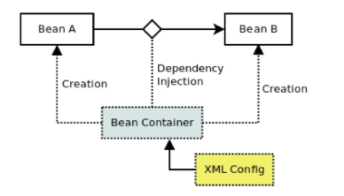

# IoC/DI


### IoC (Inversion of Control)

- 프로그램의 제어권을 가져가는 것이다.
- 개발자가 설정(properties, annotaion 등)만 하면 Container가 알아서 처리한다.
- 즉, 우리는 Framework 속에서 프로그래밍을 하는 것이다.

**코드 부품을 작성해서 주면, Framework가 실행시켜 줌**


### DIP (Dependency Inversion Principal)

- 모듈간 낮은 결합도와 테스트의 용이성을 확보하는 데 유용한 디자인 방법
- **구체적인 의존성 형식이 런타임에 결정되기 때문에 다형성을 적극적으로 활용**할 수 있으며, 의존자 모듈의 재사용성이 높아진다.

> → Controller에서 구현체인 ServiceImpl을 주입받는 것이 아니라 인터페이스인 Service를 주입받는 구조라고 생각하면 될듯 하다.

**DIP가 주장하는 바의 핵심은 추상화에 의존하라는 것**이다.


### DI (Dependency Injection)

**필요로 하는 오브젝트를 스스로 생성하는 것이 아닌 외부로부터 주입받는 기법**을 의미한다.
> DI가 되지 않은 것은 배터리 일체형 휴대폰, DI를 적용한 것은 배터리 분리형 휴대폰으로 생각하면 될 것 같다. 배터리가 고장나면 일체형은 휴대폰 자체를 바꿔야 하지만(유연하지 못함), 분리형은 배터리만 교환하면 된다.

+ Dependency Inversion을 구현하는 기법 중 하나이다.
+ 의존성 주입은 Inversion of Control 개념을 바탕으로 한다. 

+ Framework에 의해 객체의 의존성이 주입되어 객체 간의 결합성을 낮춘다.


**DI와 IoC는 같은 의미로 사용된다**

→ IoC는 DI를 통해 달성되기 때문이다.


 

> Container가
>
> 1. bean 객체를 생성하고
> 2. 종속성 주입을 수행한다.


#### 장점

- 종속성 감소
- 재사용성 증가
- 더 많은 테스트 코드 구현
- 코드 읽기 쉬워짐


+ Spring Framework에서 지원하는 IoC의 형태이다.


### DI 종류

1. 생성자를 이용한 의존성 주입

   > 생성자란 객체를 생성할 때 항상 실행되는 것으로 객체를 초기화시켜준다.

   ```java
   public class FileLoader {
       private FileParser fileParser;
   
       public FIilLoader(FileParser fileParser) {
           this.fileParser = fileParser;
       }
   }
   ```

   

2. setter 메소드를 이용한 의존성 주입

   ```java
   public class FileLoader {
       private FileParser fileParser;
   
       public void setFIilLoader(FileParser fileParser) {
           this.fileParser = fileParser;
       }
   }
   ```

   

3. 초기화 인터페이스를 이용한 의존성 주입

   ```java
   public class Testcontroller {
       private final TestService testServcie;
       
       public void set(어쩌구) {
           testService.set(어쩌구);
       }
   }
   ```


## 결론

**IoC**는 부품 만들어서 주면 프레임워크가 실행시켜주는 것이고, **DIP**는 추상화에 의존하는 패턴이다. **DI**는 객체를 직접 생성하는 것이 아니라 외부로부터 직접받는 것이다.
